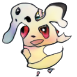
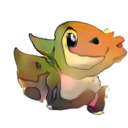
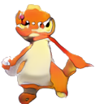

# GANkémon

This project aims at the synthetic generation of new Pokemon (GANkemon). The network used is a Progressive Generative Adversarial Network.

Here are some examples of our results:

  

## Datasets
- [Pokemon - Image dataset](https://huggingface.co/datasets/huggan/pokemon) or [Alternative Link](https://www.kaggle.com/datasets/djilax/pkmn-image-dataset)

- [The Complete Pokemon Images Data Set](https://www.kaggle.com/datasets/arenagrenade/the-complete-pokemon-images-data-set)

- [Pokemon Images Dataset](https://www.kaggle.com/datasets/kvpratama/pokemon-images-dataset)

- Game Assets Dump

- Bulbapedia - scraped top 10 images from bulbapedia for every Pokemon and manually cleaned the Dataset

### some dirty ones

- [7,000 Labeled Pokemon](https://www.kaggle.com/datasets/lantian773030/pokemonclassification)

- [Pokemon Generation One](https://www.kaggle.com/datasets/thedagger/pokemon-generation-one)

### Final Datasets

Base Dataset:

- Pokemon - Image dataset

2D Assets:

- The Complete Pokemon Images Data Set

- Pokemon Images Dataset

- Game Assets Dump

All Assets: 

- Pokemon - Image dataset

- The Complete Pokemon Images Data Set

- Pokemon Images Dataset

- Game Assets Dump

## Quality Scores

Sources: 

- [Medium: GAN — How to measure GAN performance?](https://jonathan-hui.medium.com/gan-how-to-measure-gan-performance-64b988c47732)

Scores: 

- Inception Score (IS) - measures quality based on quality of generations and their diversity

- Fréchet Inception Distance (FID)
    - uses the Inception Network to extract features and calucates FID based on them
    - is sensitive to mode collapse
    - more robust to noise than IS
    - better measurement for image diversity
    - FID between training and test set should be zero, since both real images (not valid for batches of train)
    - Lower FID values mean better image quality and diversity

- Wasserstein Distance

- SSIM Metric

- Precision?
- Recall?
- F1-Score?

